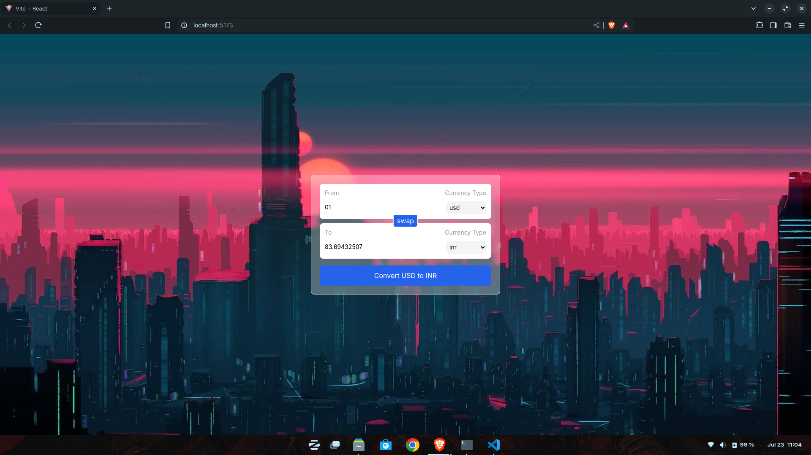

# Currency Converter

A web-based currency converter application built with React and Vite that allows users to convert amounts between different currencies.

## Features

* Convert between multiple currencies
* Easy to use interface
* Up-to-date exchange rates

## Getting Started

### Installation

1. Clone the repository: `git clone https://github.com/bixl007/Web_Dev_Projects.git`
2. Navigate to the project directory: `cd Web_Dev_Projects/currencyConverter`
3. Install dependencies: `npm install` or `yarn install`

### Running the Application

1. Start the development server: `npm run dev` or `yarn dev`

### Using the Application

1. Select the currency you want to convert from and to using the dropdown menus.
2. Enter the amount you want to convert.
3. Click the "Convert" button to see the converted amount.

## Technologies Used

* React
* Vite

